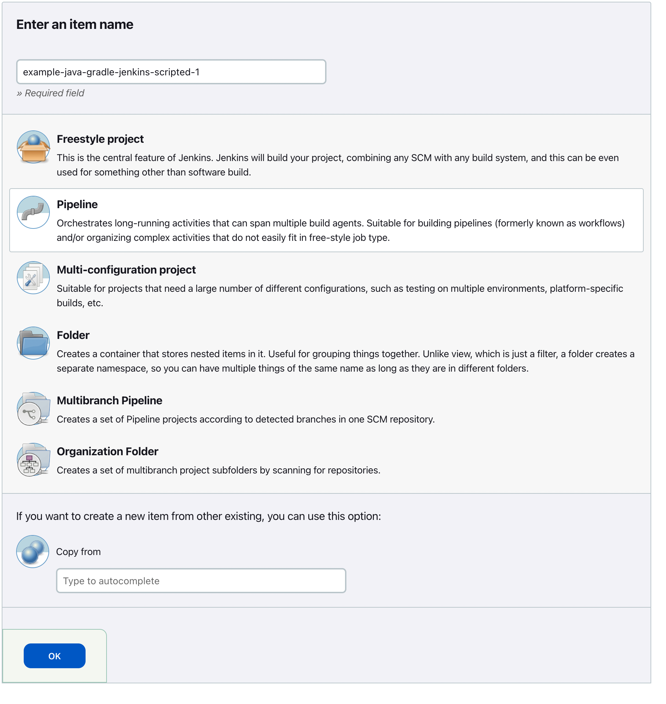

# Using a Scripted Pipeline to deliver Java Libraries with Gradle

Prerequisites

- Git Setup: https://github.com/jvalentino/setup-git
- Having setup Docker and Docker Compose: https://github.com/jvalentino/setup-docker
- Local Jenkins: https://github.com/jvalentino/example-docker-jenkins
- Building Java 101: https://github.com/jvalentino/java-building-101
- Gradle-Java Part 1: https://github.com/jvalentino/example-java-gradle-lib-1
- Gradle-Java Part 2: https://github.com/jvalentino/example-java-gradle-lib-2
- Gradle-Java Part 3: https://github.com/jvalentino/example-java-gradle-lib-3
- Gradle-Java Part 4: https://github.com/jvalentino/example-java-gradle-lib-4
- Jenkins-Freestyle: https://github.com/jvalentino/example-java-gradle-jenkins-freestyle

# (1) Initial Pipeline

